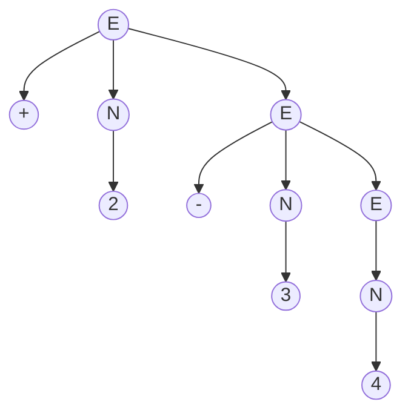
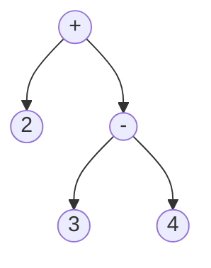

# Interpreters and Compilers
We know that grammars can be used to describe a language.
$$
\begin{aligned}
& E \rightarrow +NE|-NE|*NE|/NE|N \\
& N \rightarrow 0|1|2|3|4|5|6|7|8|9 \\
\end{aligned}
$$
We will call this language Math-ew, which takes advantage of recursive definitions.
With Math-ew, we can write expressions such as "+ 3 4" or "- 3 \* 4 + 5 2". 
- With the first expression, we are targeting the first case for E. Then N leads to the value of 3. Then E leads to N which leads to 4.
- With the second expression, we take the second case for E. N leads to 3, then E leads us to the third case giving us \* N E, which then N leads to 4. The next part (+ 5 2) results in the first case again, evaluating E as + N E, which then N is 5 and then E is N which is 2.
 
However since we now have the ability to recognize sentences, we still don't have the ability to evaluate the sentence to receive an answer to these sentences. This is where interpreters and compilers come into play.  
## Compilers and Interpreters
**Compilers** take the text file (source file) that we've written and converts it into an assembly file (technically also a text file), and then something called an assembler then converts it into the required machine code to execute. 
- To put it simply, compilers are language translators, so theoretically we can translate Java to C, or Python to Rust. 
**Interpreters** are basically super simple compilers. The difference is that interpreters take statements one at a time within a text file and immediately evaluates these statements into a value, whereas compilers converts entire files first and then performs more conversions.
 
However, both tools require three things:
- **Lexers**: converts text files to a list of tokens.
- **Parsers**: takes the list of tokens and creates an intermediate representation (usually a tree).
- **Evaluators/generators**: takes the representations and either evaluates to a value (interpreter) or generates analogous code in a different language (compiler). 
### Callback to Grammars
(side note) The lexer, parser, and eval/gens are the same terms used for grammars. Calling back to them,
- Lexers for grammars check if words are included in the language, which then converts them to a list of tokens.
- Parsers for grammars checks the structure of the tokens by converting them into a valid intermediate representation (tree).
- Evaluators/Generators evaluates a valid intermediate representation into a returned value (or into another language).
 
## Lexing
Using this example:

> Your tongue does not fit comfortably in your mouth.

Lexing is just the process of figuring out what the words in the sentence are. There is no linking meanings to the words.  
We scan each word individually and we get "Your", "tongue", "does", "not", "fit", "comfortably", "in", "your", "mouth". Lexing may tag certain words as nouns, verbs, or determiners. The grammatical correctness of the sentence is not recognized at this stage. 
We create a token based off of the sentence, which an implementation in OCaml would be list created from a variant with the language definitions within it. The list would be then created by "cons-ing" the variant in a recursive function.
## Parsing
At this stage we must make sure the sentence is grammatically correct. In code, this step makes the evaluating/generating step easier.  
There are several different ways to parse a sentence but we will use a LL(1) parser, a "Left-to-right Left-derivation parser" that looks ahead by 1 token at a time. 
- This means we will be using a left most derivation when checking the grammar, reading from left to right. The 1 means we will be looking with 1 token at a time.
- A LL(1) is a type of RDP (Recursive Decent Parser).
 
Recalling Math-ew:
$$
\begin{aligned}
& E \rightarrow +NE|-NE|*NE|/NE|N \\
& N \rightarrow 0|1|2|3|4|5|6|7|8|9 \\
\end{aligned}
$$
Here is a Math-ew sentence, "+ 2 - 3 4", structured as a parse tree:

Creating a parse tree for an LL(1) is very detailed, so we are usually concerned with creating a more general tree for understanding the deductions of a sentence for a language. These general trees is called AST (Abstract Syntax Tree) which only makes a tree based off of the content of the language. 
For the same sentence "+ 2 - 3 4", we have the following AST:

## Evaluating/Generating
Here we will create meaning from the parser trees generated from the parser. Given a well made AST, this step should be a post-order traversal.  
The example above, "+ 2 - 3 4", results as 1 since we end up with an equation ${2 + (3 - 4) = 1}$  with post order traversal.