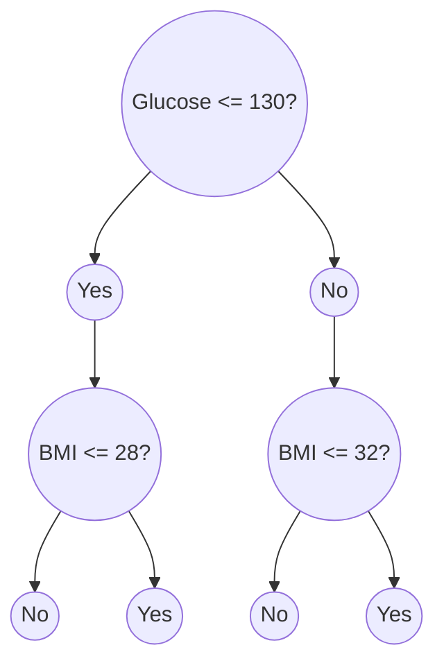

# Decision Boundaries
- When we train a classifier with n classes, we divide the space of inputs up into two sets. Recall the *Decision Boundary* is the boundary between the two sets.
- Ex: suppose we train a decision tree on continuous values to detect diabetes:

### Coming Up: 
- Perceptrons and Support Vector Machines (SVMs) have linear decision boundaries (hyperplanes).
- Neural Networks and Kernel SVMs have non-linear decision boundaries.
- In both cases there are a set of parameters that control the decision boundary.
- We have the optimization problem of finding the set of parameters that produce a decision boundary with the smallest loss.

# Gradient Descent
- Essentially a greedy approach of minimizing loss.
- Make small changes to the parameters.
- Chooses the small change that reduces the loss as much as possible.
- Think of this as trying to get to the highest point by always taking a step straight uphill.
- Pros: 
	- This can be applied to almost any problem.
	- In high dimensional spaces, you are less likely to get stuck.
- Cons: 
	- This can lead to getting stuck in a *local optimum*, (it probably wouldn't get you to the top of Mount Everest).
## Gradient
- The gradient tells you the direction of steepest ascent, and it tells you how rapidly the loss changes when you move in that direction.
- This is encoded as a vector.
	- The direction of the vector is the steepest direction.
	- The magnitude of the vector says how rapidly you change.
- This is a true to first-order.
	- These values are true for infinitesimally small steps.
	- Just as the derivative tells you how rapidly a function is changing for very small changes in the input.

# Perceptrons
$a= [\sum_{d=1}^{D}w_{d}x_{d}] + b$
- It looks for a hyperplane that best divides the problem space to define classes.
	- Compute $a$ as a linear combination of D features plus bias $b$.
	- We can then classify a sample based on whether $a > 0$ or $a < 0$.
	- Or we can say label $y = 1$ or $-1$. We want $ya > 0$.
	- Without $b$, the hyperplane goes through origin.
- Each correct classification is a linear constraint on $w$ and $b$.
	- Finding a solution is equivalent to solving a linear programming problem.
- Motivation:
	- Best practices to try to complete tasks in a linear fashion.
	- 